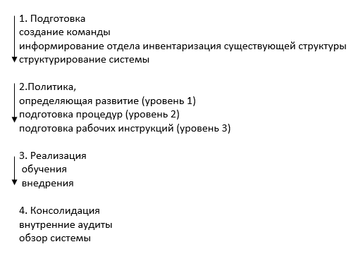

.. _introduction:

Введение
===========

Перед началом научно-исследовательской работы передо мной стояло несколько задач для ознакомления и/или подробного изучения: 

1. Узнать о профессии медицинского физика и его обязанностях, тонкостях его работы. В рамках этой задачи были получены 
основополагающие знания о *системе качества*.

.. sidebar:: Quality assurance

    Некая система, на которой строится лучевая терапия или лечение онкологических заболеваний. 
    Она обеспечивает не только постоянный контроль квалифицированного подхода к лечению, 
    но и непрерывное повышение "качества" лечения (выявляя недостатки, вводя ограничения, постановляя задачи - привнося порядок).

Система качества обеспечивает также некую "бизнес" модель управления.
Для осуществления контроля качества требуются достаточные ресурсы: 

* Персонал
   
* Необходимое оборудование и время для выполнения конкретных задач

* Обеспечение непрерывного профессионального образования

Необходимо также подключить все группы персонала для быстрого внедрения данной программы. 
Качественный проект по внедрению системы качества обычно проходит 4 последовательных стадии:

    Стадии внедрения системы качества

2. Разобраться с физической стороной лучевой терапии, а именно научиться моделировать взаимодействия частиц, используя возможности компьютера. Нам был предоставлен проект
"MCSimulator" [1]_, который позволяет проводить симуляции для конкретной задачи с определенными параметрами и геометрией. Он основан на использовании численных методов
расчета, называемых *методами Монте-Карло.* Это направление для себя я выбрал в качестве основного, поэтому о нем далее будет описано более подробно.

.. [1] Проект в Visual Studio.