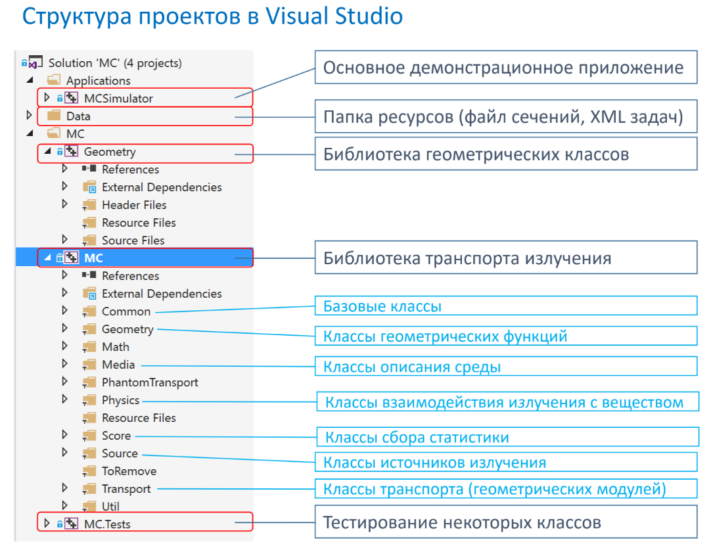
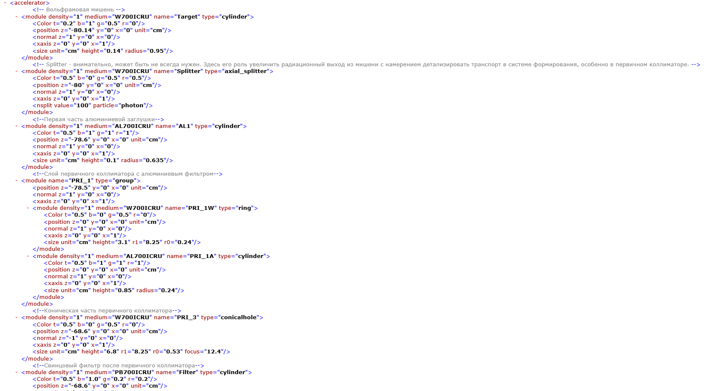
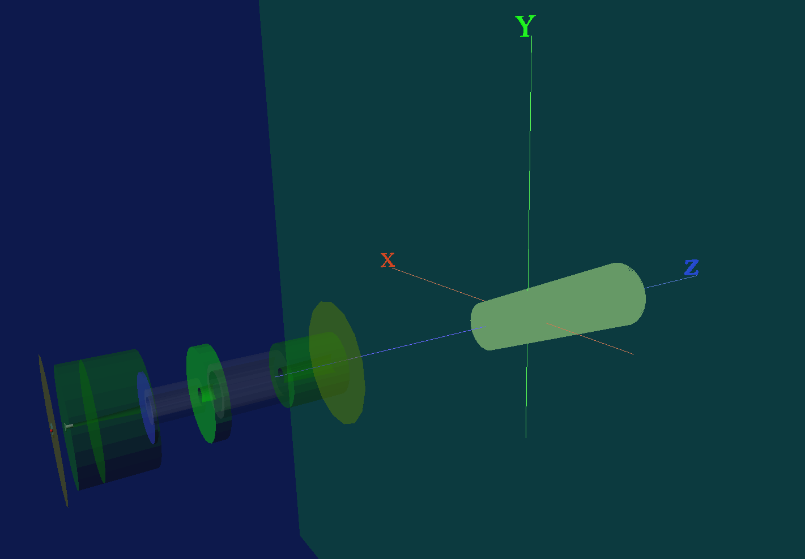
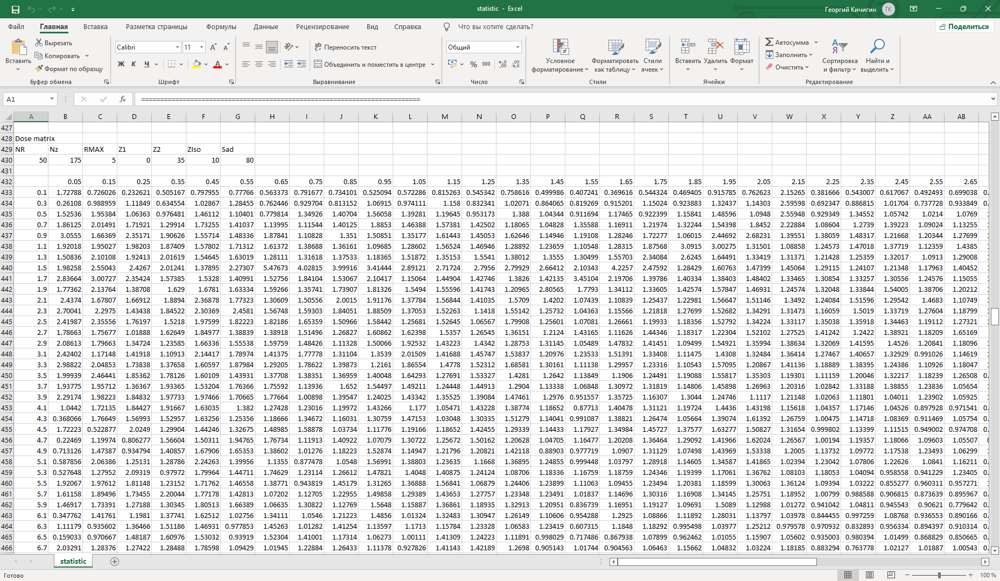
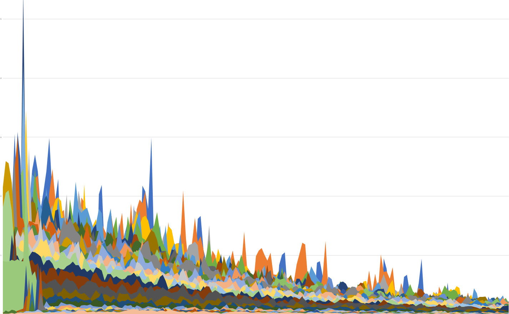

.. _MC_methods_general:

Методы Монте-Карло
====================

Что такое методы МК?
~~~~~~~~~~~~~~~~~~~~~

Общепринятого определения метода Монте-Карло нет. Чаще всего так называют численные методы решения математических задач при помощи моделирования случайных величин.
Моделирование случайных величин означает воспроизведение на компьютере модели реального явления, имеющего случайную природу.
Например, компьютер может имитировать карточную игру.
Или довольно часто на компьютерах получают синтетические данные измерений, которые выглядят как настоящие.
Такие данные используются при тестировании работы различных систем, предназначенных для их обработки.
Применение данный метод нашел и в медицинской физике.
Использование метода Монте-Карло в исследованиях и для решения прикладных задач радиационной медицинской физики за последние два-три десятилетия возросло с такой скоростью,
которую, пожалуй, можно назвать беспрецедентной. Огромное количество работ действительно отражает множество и широкий спектр проблем,
решаемых с помощью метода Монте-Карло, и неизменно высокий уровень активности в этой области.
Интерес к методам Монте-Карло возрос из-за необходимости точных численных методов для решения различных проблем переноса излучения,
возникающих в лучевой терапии, медицинской визуализации и ядерной медицине.
Требуемый уровень точности рассчитанной дозы, безусловно, может быть достигнут с использованием метода Монте-Карло.
Кроме того, имея прочную математическую основу, метод отличается высокой надежностью: большие ошибки маловероятны, если расчеты выполнены правильно.
Кроме того, метод относительно прост, по крайней мере концептуально, что упрощает весь процесс, от изучения техники до тестирования программного обеспечения и
интерпретации численных результатов. Наконец, прогресс, достигнутый в решении проблем,
с которыми сталкиваются в области радиационной медицинской физики с использованием метода Монте-Карло техника была бы невозможна,
по крайней мере в нынешних масштабах, без разработки удобного для пользователя программного обеспечения, которое значительно упростило доступ к этому мощному методу.

Использование методов Монте-Карло в лучевой терапии
~~~~~~~~~~~~~~~~~~~~~~~~~~~~~~~~~~~~~~~~~~~~~~~~~~~~

Метод Монте-Карло в лучевой терапии - основной метод дозиметрических рассчетов. Он появился в ходе работы над задачами медицинской физики на протяжении около 20 лет.
Предоставленный нам проект обладает следующей структурой:

    Структура проектов МК

Огромное количество встроенных библиотек, классов, геометрий и параметров задач позволяют провести симуляцию (розыгрыш) практически любого процесса и взаимодействия.
Самое главное преимущество данного проекта, возможность изменять data файлы для проведения самых различный симуляций и возможность решать значительную часть практических
задач, каждая из которых описывается двумя xml файлами.

В качестве примера рассмотрим симуляцию Киберножа. Так выглядит файл геометрии:

    xml файл геометрии Киберножа

В ходе симуляции в рабочей папке создается .wrl файл (трехмерный объект), позволяющий более наглядно рассмотреть геометрию задачи:

    Геометрия Киберножа

Также создается .dat файл (файл с данными), содержайщий в себе различные виды сечений, матрицы доз и прочую полезную для анализа информацию.
Открывая данный файл при помощи excel, мы можем построить гистограммы распределений частиц для модели и дозовые распределения:

    Данные, полученные в ходе симуляции

    Дозовое распределение

Возможное развитие
~~~~~~~~~~~~~~~~~~~~

В наше время в качесте источника случайности (генератора случайных чисел) используются либо физический датчик случайных чисел [1]_, либо датчики псевдослучайных чисел.
Если при использовании первого особых проблем не возникает, то использование второго приводит к следующей проблеме. При увелечении количества итераций, начиная с 
N-ой итерации точность расчетов не будет увеличиваться. Это происходит по причине того, что датчики псевдослучайных чисел обладают неким периодом. Лучшим решением в 
данной ситуации будет построение собственного генератора, имеющего заведомо известный и большой период.

Кроме увеличения количества итераций (самый простой способ), для ускорения проведения расчетов существует процедура, называемая "Variance reduction". 

.. [1] Устройство, генерирующее последовательность случайных чисел на основе измеряемых, хаотически изменяющихся параметров протекающего физического процесса. Работа таких устройств часто основана на использовании надёжных источников энтропии, таких, как тепловой шум, дробовой шум, фотоэлектрический эффект, квантовые явления и т. д.
