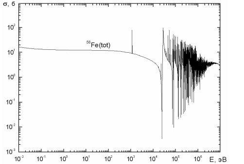
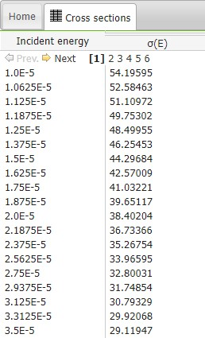
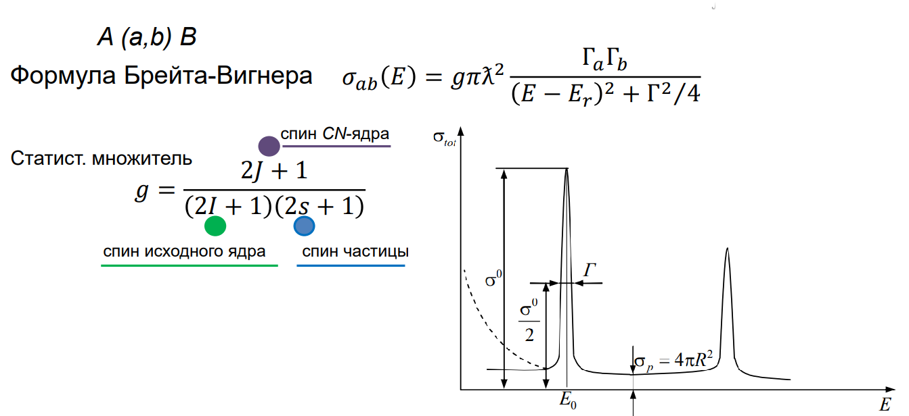

.. _neutrons:

Нейтроны
===============

Физика нейтронов. Проблемы имплементации
~~~~~~~~~~~~~~~~~~~~~~~~~~~~~~~~~~~~~~~~~~~~~~~~~~~~~~~~~~~~~

Нейтрон – особенная частица,
единственная нестабильная среди всех, обладающая средним временем жизни
около 15 минут. Для нейтронов различают два типа взаимодействия с ядрами:

1) Упругое потенциальное рассеяние на ядерных силах. При этом нейтрон не
попадает в ядро, но проходит достаточно близко от него.

2) Ядерные реакции различных типов: :math:`(n,γ), (n,p), (n,α),` деление ядра, упругое
рассеяние с заходом в ядро.

Особую сложность для имплементации нейтронов представляет
резонансный характер их сечений (рис. 5.1.1). Сечение взаимодействия или
эффективное сечение (микроскопическое) – это величина количественно
характеризующая вероятность взаимодействия элементарной частицы с ядром
или другой частицей, измеряющаяся в барнах (1 барн = 1 :math:`см^2`). Эта величина
вводится в рассмотрение из следующих соображений. Пусть имеется пучок
моноэнергетических нейтронов плотностью потока :math:`Ф = nV` (n – плотность
нейтронов в пучке; V – их скорость), падающих перпендикулярно к тонкой
мишени (тонкая – для того, чтобы ядра мишени не «затеняли» друг друга). Число
реакций R (или любых взаимодействий) в единице объема за единицу времени
(скорость ядерной реакции), происходящих в этой мишени, пропорционально
плотности потока нейтронов Ф, вызывающих реакцию и концентрации ядер в
мишени в единице объема N. Коэффициент пропорциональности 𝜎 называется
эффективным микроскопическим сечением:

.. math::

    𝜎[см^2] = \frac{R[см^{-3} * с^{-1}]}{N[см^{-3}] * Ф[см^{-2} * с^{-1}]}

    Резонансный характер сечений нейтрона

Также сложность имплементации нейтронов в код представляют продукты их взаимодействия с ядрами:
необходимо реализовать в коде генерацию проудктов и, учитывая вероятность их испускания на определенный угол,
разыгрывать соответствующее событие.

.. math::
    (n,n): {^{40}Са} + n → {^{39}Са} + n ~ (1)

    (n,n'): {^{60}Ni} + n → {^{60}Ni^*} + n ~ (2)

    (n,γ): {^{197}Au} + n → {^{198}Au} + γ ~ (3)

    (n,f): {^{235}U} + n → {^{135}Te} + {^{98}Zr} + 2n ~ (4)

Сечения. Возможные библиотеки и способы их чтения.
~~~~~~~~~~~~~~~~~~~~~~~~~~~~~~~~~~~~~~~~~~~~~~~~~~~~~~~~~~~~~~~~

Существует некоторое количество библиотек сечений, в которых
содержится множество данных о взаимодействии частиц с ядрами. Один из
интересных и полезных ресурсов, ознакомление с которым произошло в ходе
научной работы – JANIS (Java-based nuclear information software). JANIS – это
огромная платформа, на которой можно найти множество библиотек
взаимодействий в разных форматах, таких как ENDF (evaluated nuclear data file),
EXFOR (exchange format; experimental nuclear reaction data) и CINDA (computer
index to neutron data), а также отдельные данные по резонансам, распадам и многому
другому.
Более подробно были изучены библиотеки в формате ENDF/B-VIII
(рис. 5.2.1). 

    Таблица зависимости полного сечения от энергии для :math:`^{16}O` в формате ENDF/B-VIII

Для каждого элемента своя шкала энергий, но уже найден способ для
приведения всех нуклидов к одной шкале, для упрощения расчетов и
интерполяции – изучение NJOY. NJOY – программа для обработки данных о
ядерных взаимодействиях, в том числе для создания файлов сечения
непрерывной энергии в быстром формате “ace” для использования с
программами “Монте-Карло”.

Сопутствующая литература и возможности для дальнейшего продвижения.
~~~~~~~~~~~~~~~~~~~~~~~~~~~~~~~~~~~~~~~~~~~~~~~~~~~~~~~~~~~~~~~~~~~~~~~~~~~~~~~~~~~~~

Основополагающей книгой для дальнейшего продвижения является "Моделирование переноса излучения" М. П. Панина.
В книге подробно изложена не только физика переноса ионизирующих ихлучений и их взаимодействий с веществом,
но и реализация метода Монте-Карло в рамках нашей задачи. Следом из этого вытекает необходимость подробного 
изучения в летний период данной литературы.

Также для имплементации нейтронов в код неизбежно погружение в "Основы нейтронной физики" Ю. В. Стогова, где
максимально подбробно и наглядно объяснены все особенности работы с нейтронами.

Очень важно параллельно с теорией изучать мануалы по использованию "Монте-Карловского" кода и/или аналоги проекта MC, 
такие как MCNP, Geant4, Fluka, Penelope project и их документации, чтобы, наконец, максимально приблизиться к возможности
собственной имплементации нейтронов в код.

    Формула Брейта-Вигнера ("Основы нейтронной физики")