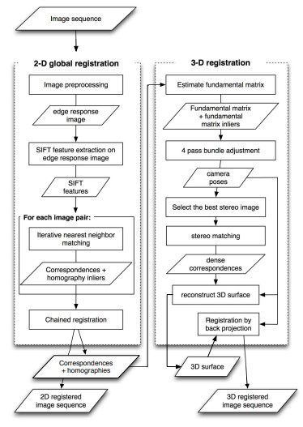

.. _Fundus:

Фундус камеры
====================

Принцип работы фундус камеры
~~~~~~~~~~~~~~~~~~~~~~~~~~~~~~~~~~

.. sidebar:: Фундус камера

    Фундус камера - прибор, используемый в офтальмологии для получения изображений глазного дна. 

Существует множество подвидов ретинальных камер:

* Мидриотические/немидриотические (для первых необходимо расширение зрачка путем закапывания специальнх препаратов, для вторых соответственно нет)
* Стационарные/портативные
* С автоматической/ручной фокусировкой

Алгоритм работы с ними примерно одинаков:

1. Наведение прибора на глаз в инфракрасном освещении, чтобы зрачок не сузился.
   
2. Фокусировка камеры на поверхности сетчатки глаза.
   
3. Нажатие на кнопку спуска фундус камеры активирует специльную вспышку тороидальной формы. Свет попадает внутрь глаза, отражается и 
   возвращается в объектив камеры, где система синхронизации спускает затвор фотоаппарата, чтобы камера зафиксировала отраженный свет.

    Механизм работы фундус камеры

Особенная форма вспышки света необходима для того, чтобы лучи света шли до поверхности сетчатки и обратно непересекающимися путями.
В качестве результата работы мы получаем изображение глазного дна (которое в дальнейшем при надобности можно обработать):

    Фундус снимок без обработки

    Фундус снимок в бескрасном фильтре

    Пациент на осмотре глазного дна

При планировании лечения необходимо учитывать факт искажения изображения оптической системой фундус камеры:

    Снимок шахматной доски фундус камерой

Искажения тем сильнее, чем дальше от центра изображения.

Фундус диаграммы
~~~~~~~~~~~~~~~~~~~~

Диаграмма глазного дна представляет собой проекцию сферической поверхности, простирающейся от заднего полюса до лимба.
Поперечный срез правого глаза показан в верхней части рисунка 7.2.1, а значок камеры указывает направление обзора.
В центре диаграммы находится задний полюс. Относительно этого центра радиальное расстояние (R) прямо пропорционально длине дуги вдоль меридиана сетчатки.
Расстояние, измеренное по окружности, также пропорционально длине дуги, но коэффициент масштабирования является функцией R, а не постоянной величиной.
Схематическое изображение этой поверхности показано в нижней половине рисунка 7.2.1 в виде серии из трех концентрических кругов в корональной плоскости, которые соответствуют анатомическим областям глаза.
Самый внутренний круг представляет экваториальную окружность в корональной плоскости, и внутренняя поверхность глаза от экватора до
заднего полюса содержится внутри этого круга. Несмотря на то, что это самый маленький круг, его диаметр представляет собой наибольшую длину хорды на чертеже.
Эта область содержит диск зрительного нерва, где зрительный нерв проходит через склеру, а также макулу (которая окружает ямку),
которая является областью наибольшей остроты зрения, обнаруженной на заднем полюсе глаза.

Следующий по величине круг представляет окружность в корональной плоскости в зубчатой области, которая является точкой,
в которой сетчатка заканчивается в ресничном теле. Область, расположенная между этим кругом и экватором, представляет собой полосу
на внутренней поверхности глаза от экватора до зубчатой оболочки. Самый внешний круг на диаграмме глазного дна — это окружность в
корональной плоскости лимба, которая является точкой, в которой склера заканчивается роговицей. Этот круг,
хотя и кажется самым большим на диаграмме, на самом деле представляет собой наименьший диаметр из трех.
Поскольку центральная точка диаграммы представляет задний полюс глаза, любое радиальное смещение от этой точки
представляет собой сдвиг в переднем направлении вдоль меридиана сетчатки, так что наиболее переднее положение диаграммы достигается на самом внешнем круге.

    Фундус диаграмма

Фотография глазного дна часто выполняется, чтобы помочь в диагностике и локализации задних опухолей. Процедура обычно занимает 20 минут и обычно проводится в
офтальмологической клинике. С использованием специализированной камеры глазного дна и устройства для иммобилизации фотографии делаются через расширенную радужную
оболочку пациента в направлении заднего полюса. Глаз поворачивается, следуя за целевым светом другим глазом, так что клинически значимая часть заднего полюса и
периферии попадает в поле зрения камеры. Из этих изображений получается составной или монтажный вид путем наложения основных кровеносных сосудов, которые являются
общими, начиная от зрительного нерва и двигаясь к периферии во всех направлениях, так что получается расширенный вид задней поверхности глаза.

    Расширенная (панорамная) диаграмма

    Диаграмма на панорамном фундус снимке

Слияние нескольких фундус изображений в панорамное
~~~~~~~~~~~~~~~~~~~~~~~~~~~~~~~~~~~~~~~~~~~~~~~~~~~~~~~~~~~~~~~~~~~~~~~

Панорамные фундус изображения (мозаики) используются для более детального анализа поверхностии глазного дна. Их получают совмещением 
двух и более снимков, для этого необходимо рассмотреть одну и ту же точку на поверхности ретины с двух разных 
камер (или двух положений одной камеры) и, соответственно, систем отсчета :cite:`2002:panoram` (рис. 8.3.1).

    Иллюстрация глазного дна и глаза с двух точек наблюдения камеры

При построении в линзе или системе линз (структуры глаза, оптическая система фундус камеры) изображения поверхности глазного дна (аппроксимируемого
сферической поверхностью) оно является квадратичной поверхностью

.. math::

    Z = A_{1}X^{2} + A_{2}XY + A_{3}Y^{2} + A_{4}X + A_{5}Y + A_{6}

Выразим одну и ту же точку на поверхности глазного дна через другую при помощи матрицы перехода

.. math::

    \begin{bmatrix} 
        X^{'} \\
        Y^{'} \\
        Z^{'}
    \end{bmatrix}
    = \begin{bmatrix}
    r_{11} & r_{12} & r_{13} \\
    r_{21} & r_{22} & r_{23} \\
    r_{31} & r_{32} & r_{33}
    \end{bmatrix}
    \begin{bmatrix}
    X \\
    Y \\ 
    Z
    \end{bmatrix}
    + \begin{bmatrix}
    t_x \\
    t_y \\
    t_z
    \end{bmatrix}

И, наконец, рассмотрим матрицы проекции со слабой перспективой (weak-perspective projection)

.. math::

    M_{p} = \begin{bmatrix}
    α_x & 0 & 0 & c_x \\
    0 & α_y & 0 & c_y \\
    0 & 0 & 0 & s 
    \end{bmatrix}
    ,
    M_{q} = \begin{bmatrix}
    α^{'}_{x} & 0 & 0 & c^{'}_{x} \\
    0 & α^{'}_{y} & 0 & c^{'}_{y} \\
    0 & 0 & 0 & s^{'}
    \end{bmatrix}

Здесь :math:`α_y, α_x, α^{'}_{x}, α^{'}_{y}` - пиксельные координаты на изображении, 
:math:`c_x, c_y, c^{'}_{x}, c^{'}_{y}` - нодальные точки (центры проекции) для двух камер, а
:math:`s, s^{'}` - параметры увеличения изображения.

Используя приведенные уравнения можно получить координаты одной точки на изображении в системе координат другого.

Слияние фундус изображений с МРТ
~~~~~~~~~~~~~~~~~~~~~~~~~~~~~~~~~~~~

Для слияния фундус снимков с МРТ нам необходимо найти общие точки, различимые на обоих. На МРТ различимы: оптический диск, склера, поверхность сетчатки, хрусталик и
роговицу. На ретинальном снимке: сосуды, оптический диск и макулу. Один из очевидных ориентиров - оптический диск (диаметром примерно 2мм, точка входа
зрительного нерва в сетчатку), определяемый в виде яркого диска на фундус снимке и как пересечение зрительного нерва с поверхностью сетчатки на МРТ.
Но необходим второй ориентир для масштабирования и вращения изображения - макула, а точнее центральная ямка макул, находящаяся на
пересечении зрительной оси и поверхности сетчатки.
 
 Рассмотрен алгоритм, приведенный в статье Landmark Detection for Fusion of Fundus and MRI Towards a Patient-Specific Multi-Modal Eye Model :cite:`2015:fusion`:

 1. Определение центра (симметрии) глаза и обрезка до области интереса (производится автоматически).
   

    Определение центра симметрии глаза (1)
  

    Определение центра симметрии глаза (2)

2. Определение поверхности сетчатки путем построения из центра симметрии глаза лучей во все стороны и определения первого перепада
   градиента (перед этим с МРТ снимка убран шум с области стекловидного тела).

3. Определяется оптическая ось как центр симметрии хрусталика глаза, при этом производится оптимизация функции энергии,
   которая повышает точность нахождения оптической оси.

4. Диск зрительного нерва определяется пересечением между зрительным нервом и сосудистой оболочкой/сетчаткой. Этот ориентир легче различим,
   потому что зрительный нерв идентифицируется в объеме МРТ как яркая трубчатая структура. Поэтому в данной работе используется фильтр сосудистости,
   параметризованный в соответствии с диаметром зрительного нерва. Он основан на собственных значениях гессиана, которые представляют кривизну вдоль осей.
   Если одна из трех кривизн близка к нулю, а две другие отличны от нуля, то точка лежит на трубчатой конструкции.

5. Положение макулы на МРТ можно оценить, используя ранее обнаруженные ориентиры. Зрительная ось, проходящая через хрусталик и ямку, отклоняется от оптической оси на угол κ составляющий около 3,93 ± 2,68◦ в левом глазу и 3,91 ± 2,73◦ в правом глазу. Это ограничивает положение ямки конусом угла κ (каппа) от хрусталика, пересекающегося с сетчаткой.
   Вторым ограничением является расстояние от диска зрительного нерва. Предыдущие исследования показали, что расстояние между ямкой и диском зрительного нерва в глазах младенцев составляет 4,4 ± 0,4 мм. 
6. Определение макулы и диска зрительного нерва на ретинальном снимке при помощи того же алгоритма с использованием фильтров (светлого - для нахождения диска зрительного нерва и темного - для макулы)

    Автоматическое определение ориентиров

На этом заключительном этапе найденные ориентиры и сегментация используются для объединения МРТ и фотографии глазного дна в одну трехмерную
модель. Слияние выполняется в три этапа. Сначала генерируется виртуальное изображение ориентиров на МРТ.
Впоследствии ориентиры на глазном дне регистрируются на виртуальном изображении. На последнем этапе фотография глазного дна проецируется на
предварительно сегментированную поверхность сетчатки. Для создания виртуального изображения ямка и диск зрительного нерва проецируются обратно через
линзу на плоскость перед глазом (см. рис. 7.3.4). Плоскость ориентирована таким образом, что перпендикулярна оптической оси. Виртуальное изображение преобразуется
в ту же двумерную плоскость, что и фотография глазного дна. Затем два изображения регистрируются, поскольку эти два ориентира присутствуют как на виртуальной
фотографии, так и на фотографии глазного дна. Для регистрации выбирается преобразование подобия. Наконец, зарегистрированное глазное дно проецируется обратно
в плоскость в передней части глаза, а оттуда через хрусталик на сегментированную поверхность сетчатки.

    Автоматическое определение ориентиров

Преобразование координат при получении фундус снимка
~~~~~~~~~~~~~~~~~~~~~~~~~~~~~~~~~~~~~~~~~~~~~~~~~~~~~~~~~~~

Критически необходимо получить матрицу преобразования координат из 2D фундус снимка в 3D КТ или МРТ. Необходимые преобразования
могут быть получены в аналитическом рассчете процесса калибровки: определить положение трех точек на фундус снимке, положение которых на КТ/МРТ известно.

    Принципиальная схема получения изображения

    Получение изображение стерео фундус камерой 

    Координатная система для оптической системы глаз-камера смоделированной одной линзой

Большое количество методов восстановления 3D изображения с 2D фундус снимка, а также способы автоматического 
распознавания ориентиров, таких как: оптический диск, макула, разветвления сосудов глазного дна и другие описаны в работе 
ADVANCED RETINAL IMAGING: FEATURE EXTRACTION, 2-D REGISTRATION, AND 3-D RECONSTRUCTION :cite:`2006:imaging`.

Также может быть рассмотрена статья по 3D реконструкции при помощи двух фундус снимков - Retinal image registration from 2D to 3D :cite:`2008:reconstruction`.
Принципиальный алгоритм реконструкции изложен на блок-схеме (рис. 8.5.2)

    3D реконструкция
