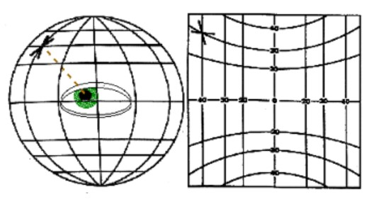
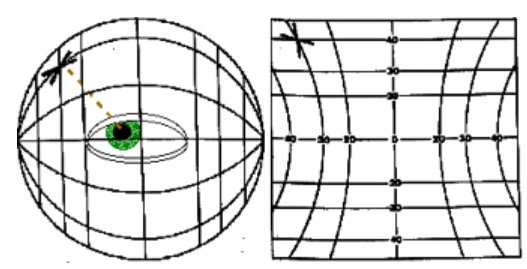
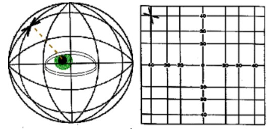
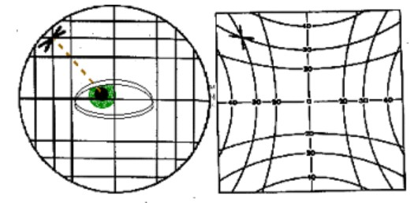
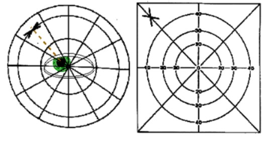

.. _Rotation:

Контроль движения глаза
=====================================

Контроль движения глаза - важная задача при проведении лучевой терапии, ведь малейшее отклонение глаза
от запланированного положения может привести к облучению критических структур.
Для осуществления контроля принципиально важно определить центр вращения глаза, а точнее центроид - фиксированная дуга, вокруг которой
глаз совершает движения.
В работе Positions of the horizontal and vertical centre of rotation in eyes with different refractive errors :cite:`2022:rotation`
центр вращения глаза определяли путем измерения того, насколько центр зрачка был смещен вбок, когда
испытуемый совершал саккаду в направлении цели периферической фиксации, которая появлялась на экране компьютера на расстоянии
80 см.

Основная задача состоит в том, чтобы описать сферические системы координат и как преобразовать сферическое вращение в евклидово
пространство касательной или проекционного экрана.  Для этой цели можно использовать карданный лазерный проектор для иллюстрации
трех классических систем координат, введенных ранее Фиком, Гельмгольцем и Листингом.  Лазер установлен на задней стороне
крупномасштабной сферы из оргстекла, которая имитирует вращение глаза вокруг различных осей, проходящих через его центр вращения.
Лазер проецируется из сферы на плоский передний проекционный экран, чтобы проиллюстрировать траекторию, по которой глаз будет
следовать на касательном экране при чисто горизонтальном вращении вокруг вертикальной оси и чисто вертикальном вращении вокруг
горизонтальной оси.  Эти траектории являются либо прямыми, либо изогнутыми в зависимости от того, использует ли система координат
оси, которые перемещаются вместе с глазом, или остаются неподвижными в голове (рис. 9.1 - 9.5). Приведенные ниже рисунки иллюстрируют
проекцию вертикального креста на сферу вокруг глаза (слева) и проекцию этого креста на касательную
плоскость (справа) для пяти различных систем координат.

    Система координат Фика

    Система координат Гельмгольца

    Система координат Харма

    Система координат Гесса

    Система координат Листинга

.. bibliography::