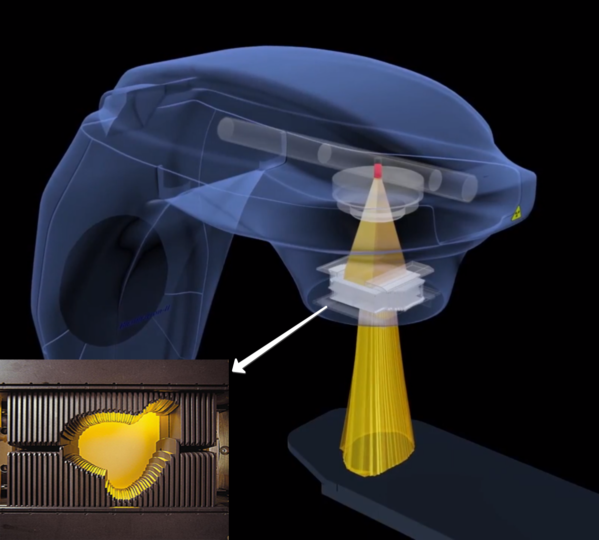
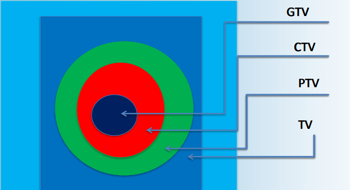

.. _Rad_therapy_rad_th:

Лучевая терапия
====================

Методики
~~~~~~~~~~~~

В общих чертах были изучены методики лучевой терапии такии как стереотаксис, 
конвенциональное облучение, облучение с модуляцией интенсивности пучка (intensity-modulated radiation therapy – IMRT); 
лучевая терапия, корректируемая по изображениям (image guided radiation therapy – IGRT) и конформное облучение.

Чуть более подробно о конформном облучении, как об одном из наиболее универсальных и точных в наше время.
Основным принципом конформной лучевой терапии является создание
высокой дозы в мишени при максимально возможном уменьшении дозы в
окружающих мишень нормальных органах и тканях. Конформное облучение
требует обязательного применения трехмерного планирования. Металлические
коллиматоры, встроенные в обычный аппарат, формируют прямоугольное
радиационное поле необходимых размеров. Современные ускорители электронов
позволяют осуществить больший контроль над тем, как позиционируются
коллиматоры. Поле необходимой формы генерируется за счет компьютерного
управления плотно прилегающих друг к другу пластин (лепестков), шириной не
более 10 мм [1]_. Именно лепестки обеспечивают возможность получать нужное нам точечное распределение доз по PTV. 

    Многолепестковый коллиматор

PTV - одно из понятий объема в лучевой терапии. Существуют также TV, CTV и GTV.

1. TV (Treated volume) - объем, получающий дозу, сопоставимую с предписанной.
2. PTV (Planning target volume) - планируемый объем мишени. Это объем, в котором учитываются все погрешности укладки пациента и смещения во время сеанса.
3. CTV (Clinical target volume) - то, что мы хотим облучить. Объем, который выражает клиническое мышление врача.
4. GTV (Gross tumor volume) - измеряемый объем опухоли

    Понятия объемов в лучевой терапии

.. [1] Изначально коллиматоры состояли из относительно небольшого числа лепестков (немногим более полусотни) шириной 2 см в области изоцентра.