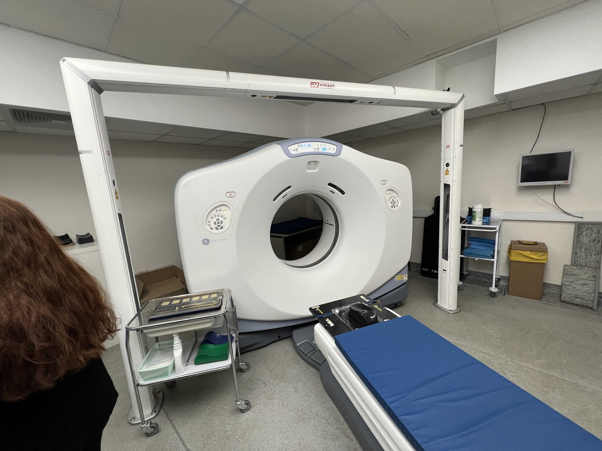
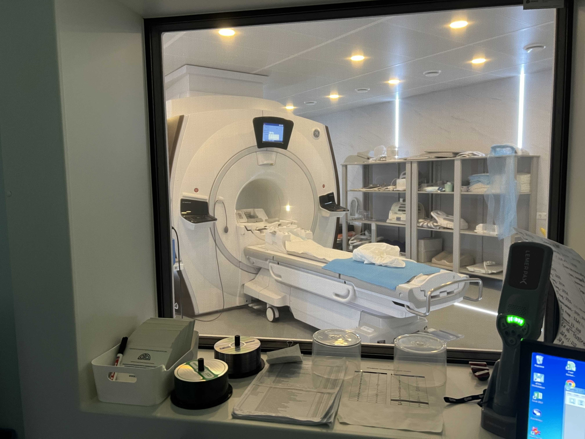
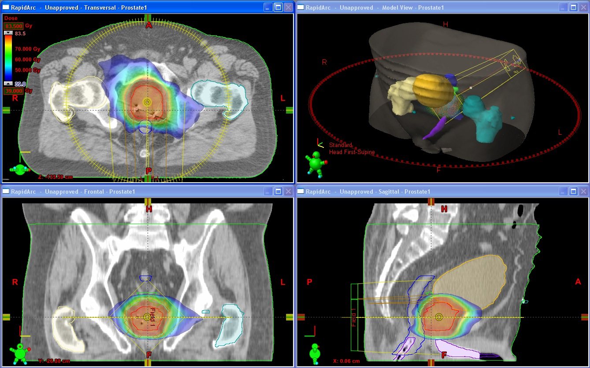
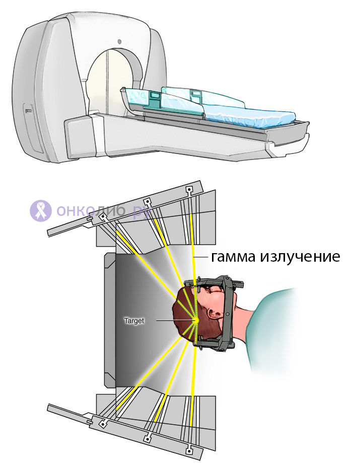
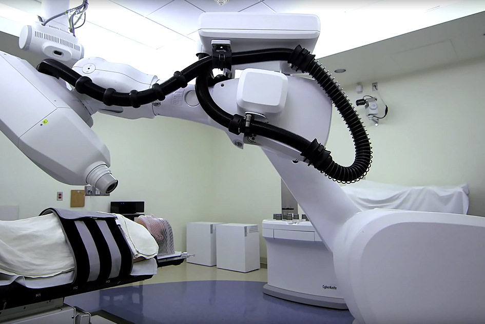
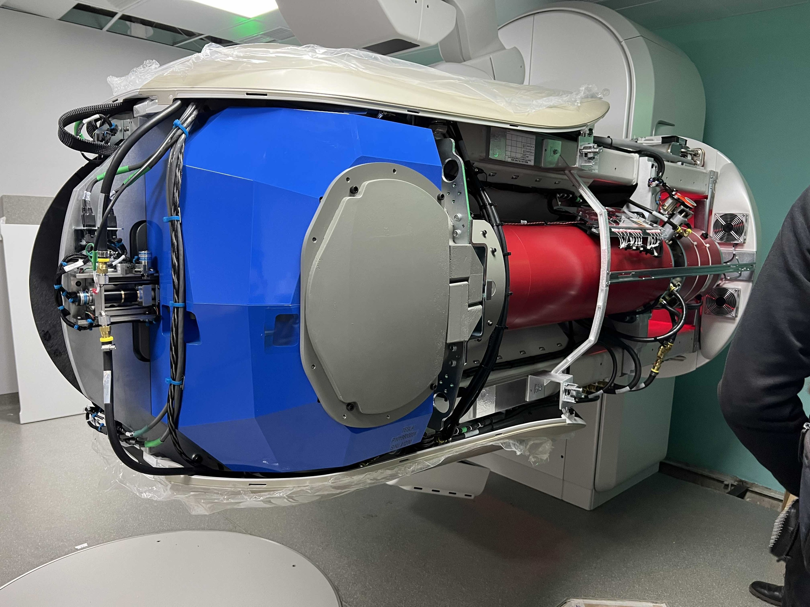

.. _burdenko:

Задачи
==========

Экскурсия в НИИ Нейрохирургии им. Бурденко
~~~~~~~~~~~~~~~~~~~~~~~~~~~~~~~~~~~~~~~~~~~~~~~

Также в рамках научно-исследовательской работы нам была предоставлена возможность посетить НИИ Нейрохирургии им. Бурденко, чтобы своими глазами увидеть 
работу отдела клинической лучевой терапии и медицинских физиков в действии.

Основополагающей обязанностью медицинского физика безсомненно является осуществление системы качества для бесперебойной и точной работы всего персонала, но также
хотелось бы рассказать о том, чем лучевая терапия "начинается" и чем "заканчивается".

Получение изображений
~~~~~~~~~~~~~~~~~~~~~~~~~~~

Все начинается с получения изображений области интереса. Как выяснить какую область облучать? Современные технологии позволяют с высокой точностью определить
местоположение опухоли при помощи КТ [1]_ или МРТ [2]_. 

    Аппарат для проведения КТ

    Аппарат для проведения МРТ

.. [1] КТ - компьтерная томография.
.. [2] МРТ - магнитно-резонансная томография.

Также в начальную стадию входит выбор способа укладки и иммобилизации пациента. Для каждого персонально изготавливаются валики, подголовники, маски, рамки, матрасы и
прочие фиксирующие приспособления, обеспечивающие неподвижность пациента во время сеанса.

Оконтуривание и планирование
~~~~~~~~~~~~~~~~~~~~~~~~~~~~~~~~

Оконтуривание опухоли проводится в системе планирования лучевой терапии для определения контуров тела, самой опухоли и близлежащих органов, рискующих попасть в зону облучения.

    Оконтуривание

Также основной задачей ставится уменьшение лечебного объема для наиболее точного облучения и снижения ущерба другим органам.

Последняя подготовка и аппараты
~~~~~~~~~~~~~~~~~~~~~~~~~~~~~~~~~~~~~~~~~~~~

Затем все рассчитанные данные передаются на аппарат для лучевой терапии. На экскурсии мы рассмотрели 3 различных аппарата:

1. Кибернож (Cyberknife)
2. Гамма-нож (Gamma-knife)
3. Тру бим (Truebeam)

Каждый из вышеперечисленных обладает своими преимуществами и недостатками.

Гамма-нож использует фотоны и применяется для лечения патологий головного мозга. Одним из недостатков является наличие изоцентра.

    Гамма-нож

Кибернож - роботизировнная установка, оснащенная линейным ускорителем, излучающем в рентгеновском диапазоне. Преимущество киберножа в том, что изоцентр у него отсутствует.
Также данная установка использует систему управления изображением. Полученные на этапе планирования изображения периодически накладываются на полученные во время сеанса. 
При смещении пациента, установка снова рассчитает измененное положение мишени и продолжит облучение. При большом смещении процесс автоматически остановится во избежание 
причинения вреда здоровью пациента.

    Кибернож

Технология TrueBeam является заново спроектированной системой контроля за проведением лучевой диагностики,
которая позволяет синхронизировать, учитывать и регулировать положение пациента и область визуализации, что позволяет наиболее полно и точно провести сеанс радиотерапии, 
проконтролировать процесс лечения в динамике. 

Truebeam в стенах НИИ нам удалось застать и в работе и в состоянии монтажа. Благодаря этому была более подробно изучена конструкция этого невероятного устройства.

    Монтируемый аппарат Truebeam